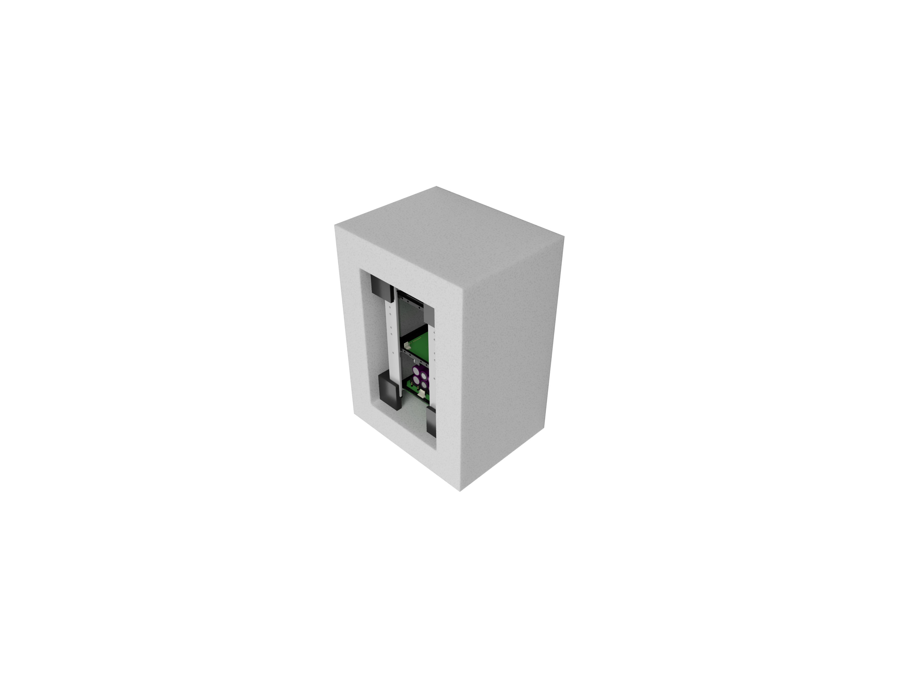
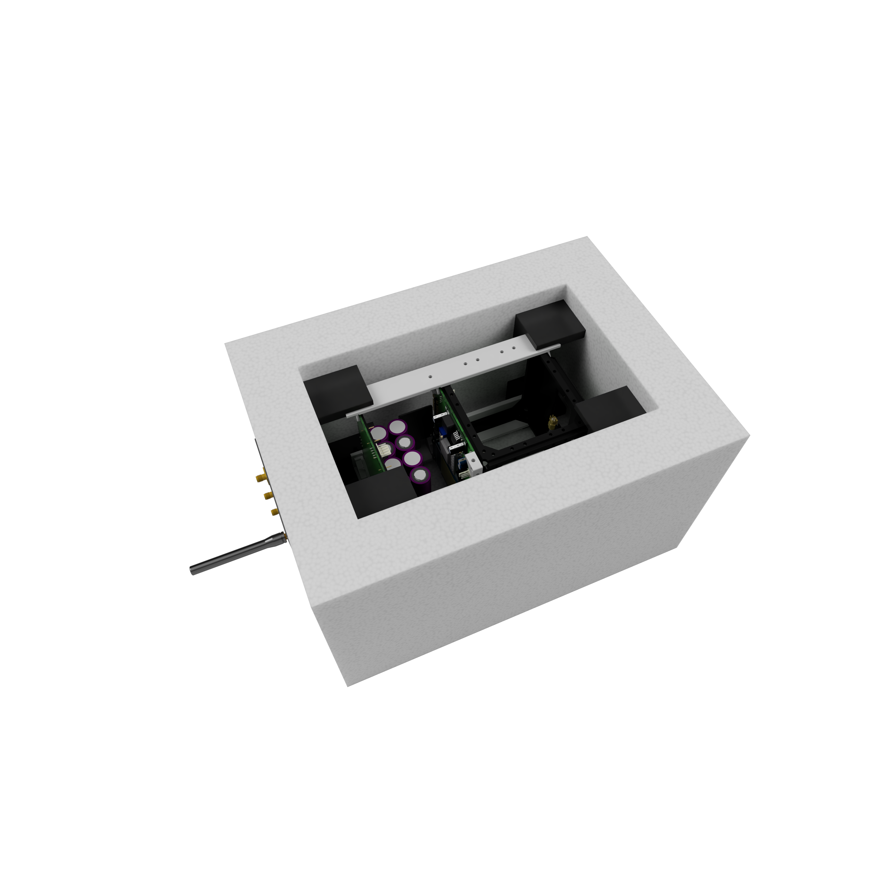
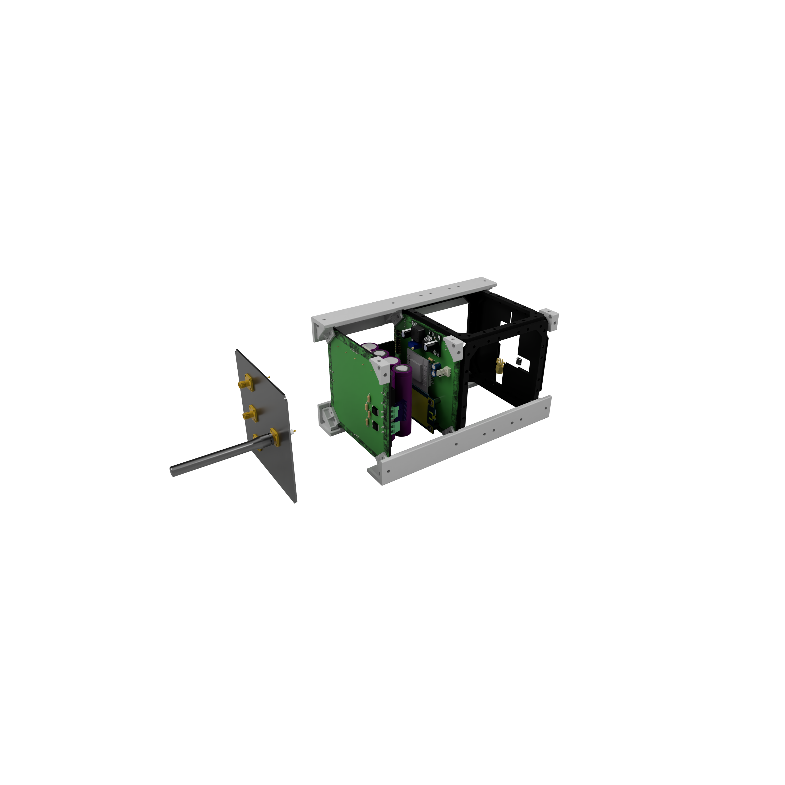

# MARSAT

Marsat is an open source project aimed at developing a platform to send student experiments to the upper atmosphere. It's intended to provide it's users the following functionalities:

* GPS tracking

* APRS telemetry

* Flight computer

* Flight termination system

* Parachute

* Battery and energy management

* Bi-directional 900 MHz data link

Experiments are mounted in the upper half of the structure and must comply with 1U cubesat dimmensios. 

The system can provide conectivity and power for up to two 1/2U experiments. 

